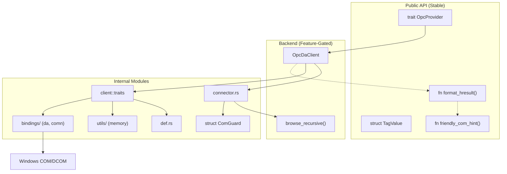

# Architecture: bytehound-opc-da-client

## 1. Project Overview

| Field | Value |
| :--- | :--- |
| **Package** | `bytehound-opc-da-client` |
| **Rust library** | `opc_da_client` |
| **Version** | `0.2.5` |
| **Purpose** | Backend-agnostic Rust library for interacting with OPC DA (Data Access) servers |
| **Spec** | [spec.md](file:///c:/Users/WSALIGAN/code/opc-cli/opc-da-client/spec.md) |
| **Status** | Stable `0.2.5` library |

The library provides an async, trait-based API that abstracts away the complexities of Windows COM/DCOM and the underlying OPC implementation. It follows a layered architecture: a **stable public API** (trait + data types) and **feature-gated backend implementations** that can be swapped without affecting consumer code.

---

## 2. Language & Runtime

| Aspect | Value |
| :--- | :--- |
| Language | Rust (2024 Edition) |
| MSRV | Rust 1.88 |
| Async Runtime | `tokio` (features: `rt`, `sync`) |
| Platform | **Windows-only** — COM/DCOM is a Windows technology |
| Trait Async | `async-trait` crate |

---

## 3. Project Layout

```
opc-da-client/
├── Cargo.toml              # Crate manifest with feature flags
├── README.md               # Crate documentation for crates.io
├── architecture.md         # This file — Technical Source of Truth
├── spec.md                 # Behavioral contracts — Behavioral Source of Truth
└── src/
    ├── lib.rs              # Crate root: module declarations, public re-exports
    ├── com_guard.rs        # Public RAII guard for caller-owned COM threads
    ├── provider.rs         # OpcProvider trait + public Rust-native data types
    ├── inventory.rs        # Bounded cancellable namespace inventory traversal
    ├── native_browse.rs    # Bounded session/page state machine
    ├── helpers.rs          # COM utilities: friendly_com_hint, variant/quality/time converters
    ├── opc_da/             # Merged from vendor/opc_da (Phase 2)
    │   ├── mod.rs          # Module root with lint allows
    │   ├── def.rs          # OPC DA type definitions (GroupState, ServerStatus, etc.)
    │   ├── utils/          # COM memory management (RemoteArray, RemotePointer, etc.)
    │   └── client/         # Client traits, versions (v1/v2/v3), iterator
    ├── bindings/           # Frozen COM bindings (Phase 3)
    │   ├── da/             # OPCDA.winmd bindgen output
    │   └── comn/           # OPCCOMN.winmd bindgen output
    └── backend/
        ├── mod.rs          # Backend module gate (feature-conditional)
        ├── connector.rs    # ServerConnector trait (Mock & Real COM backend decoupling)
        └── opc_da.rs       # OpcDaClient: concrete OpcProvider using opc_da module
```

---

## 4. Toolchain

All commands are run from the **workspace root** (`opc-cli/`).

| Tool | Command |
| :--- | :--- |
| Formatter | `cargo fmt --all -- --check` |
| Linter | `cargo clippy --workspace -- -D warnings` |
| Tests | `cargo test --workspace` |
| Verification Script | `pwsh -File scripts/verify.ps1` |
| Release Merge Script | `powershell -File scripts/Merge-ToMain.ps1` |
| Documentation | `cargo doc --no-deps --package bytehound-opc-da-client` |

The verification script ([verify.ps1](file:///c:/Users/WSALIGAN/code/opc-cli/scripts/verify.ps1)) runs all three verification gates sequentially. The release merge script ([Merge-ToMain.ps1](file:///c:/Users/WSALIGAN/code/opc-cli/scripts/Merge-ToMain.ps1)) automates clean merges to the `main` branch.

---

## 5. Error Handling Strategy

| Pattern | Details |
| :--- | :--- |
| Return type | `OpcResult<T>` for all fallible functions |
| Context wrapping | `.context()` / `.with_context()` at every propagation layer |
| Logging before propagation | `map_err(\|e\| { tracing::error!(...); e })` **before** `.context()` to preserve raw HRESULTs in logs |
| User-facing hints | `friendly_com_hint()` maps known HRESULT codes to actionable strings; `format_hresult()` wraps this into a consistent `0xHHHHHHHH: <hint>` format for error messages |
| Prohibited | `unwrap()`, `expect()`, and raw panics in production code |

---

## 6. Observability & Logging

| Aspect | Details |
| :--- | :--- |
| Framework | `tracing` crate |
| Output | File-based (TUI captures stdout/stderr) — see parent `opc-cli` for subscriber setup |
| Timing | `std::time::Instant` wrapping major COM calls (`create_server`, `query_organization`, `browse`); `elapsed_ms` logged on success |

### Log Level Usage

| Level | Usage |
| :--- | :--- |
| `error!` | COM failures, browse position corruption |
| `warn!` | Skipped branches/leaves, max depth reached, handled COM operation failures (e.g., read/write rejections) |
| `info!` | High-level milestones (server connected, browse complete) |
| `debug!` | Internal state, GUID resolution details |
| `trace!` | Known upstream bugs, iterator noise |

---

## 7. Testing Strategy

### Unit Tests
- **Location**: Co-located `#[cfg(test)] mod tests` in `helpers.rs`.
- **Coverage**: `friendly_com_hint` mappings, `filetime_to_string` edge cases, `opc_value_to_variant`, `variant_to_string` roundtrips (including `VT_CY`), and `StringIterator` self-healing behavior.

### Mock-Based Tests
- **Mechanism**: `mockall` crate, gated behind `test-support` feature.
- **Export**: `MockOpcProvider` — allows downstream consumers (`opc-cli`) to test UI and state logic without a live OPC server on any OS.

### Mock-Backend Integration Tests
- **Location**: Co-located `#[cfg(test)] mod tests` in `com_worker.rs` and `native_browse.rs`.
- **Mechanism**: In-process `MockGroup` / `MockServer` / `MockConnector` implementing `ConnectedGroup`, `ConnectedServer`, and `ServerConnector` traits.
- **Coverage**: `read_tag_values` (semantic/display intent, happy, partial reject, all reject), `write_tag_value` (happy, add fail), `list_servers` (happy).
- **Browse Coverage**: DA 3.0 page mapping and continuation, DA 2.x immediate branches/leaves, exact item IDs, flat paging, isolated sessions, invalid/closed sessions, and the hierarchical branch-only `OPC_FLAT` regression.

### Doc Tests
- `friendly_com_hint()` — runnable doctest in `helpers.rs`.
- `ComGuard::new()` — public compile-only doctest in `com_guard.rs`.

### Integration / Manual
- Tested against real OPC servers (Matrikon, ABB, Kepware) on Windows.
- See [spec.md § Required Test Coverage](file:///c:/Users/WSALIGAN/code/opc-cli/opc-da-client/spec.md) for the full checklist.

---

## 8. Documentation Conventions

| Convention | Standard |
| :--- | :--- |
| Public items | Rustdoc `///` with `# Errors` section on all fallible functions |
| Module-level | `//!` at the top of each file |
| Tool | `cargo doc --no-deps` |
| Examples | Runnable doctests for stable public API functions |

---

## 9. Dependencies & External Systems

### Core Dependencies (always included)

| Crate | Version | Purpose |
| :--- | :--- | :--- |
| `anyhow` | 1.0.95 | Error handling with context chains |
| `async-trait` | 0.1.86 | Async methods in traits |
| `chrono` | 0.4.43 | FILETIME → local time conversion |
| `tokio` | 1.43.0 | Async runtime (`rt`, `sync` features) |
| `tracing` | 0.1.41 | Structured logging |
| `uuid` | 1.x | Cryptographically random opaque browse tokens |
| `windows` | 0.61.3 | Win32 COM/DCOM/Foundation/Variant APIs |
| `windows-core` | 0.61.3 | Core COM runtime types (HRESULT, PWSTR, etc.) |

### Backend: `opc-da-backend` (default feature)

*No external dependencies. The COM bindings are included natively in `src/bindings/`.*

### Test Support: `test-support` (optional feature)

| Crate | Version | Purpose |
| :--- | :--- | :--- |
| `mockall` | 0.13.1 | Auto-generate `MockOpcProvider` |

---

## 10. Architecture Diagrams

### Layered Architecture



### COM Threading Model & Connection Pooling

OPC DA relies on Windows COM, which requires per-thread initialization and strict thread affinity for proxy pointers.
The `OpcDaClient` handles this using a dedicated **Worker Thread** and **Connection Pooling**:
1. **`ComWorker` Thread:** Initialized once via `ComWorker::start()`, it spawns a dedicated `std::thread` that calls `CoInitializeEx` in MTA mode. This thread stays alive for the lifetime of the client, exclusively owning all COM pointers.
2. **Message Passing:** The async `OpcProvider` trait functions convert caller requests into `ComRequest` elements, sending them over a Tokio `mpsc` channel to the worker. Read requests carry an explicit semantic-or-display presentation intent: semantic reads preserve exact BSTR contents, while display reads add the TUI's intentional quotes. Execution results are returned via `oneshot::Sender`.
3. **Connection Pooling:** Read, write, capability, and recursive browse operations share a cache (`HashMap<String, C::Server>`) of active server connections mapped by ProgID.
4. **Resilience & Retry:** If a cached connection becomes stale or the remote server restarts (e.g. `RPC_S_SERVER_UNAVAILABLE`), the `dispatch_with_retry` logic transparently evicts the corrupted proxy, reconnects, and retries the operation.
5. **Browse Session Isolation:** Native browse sessions own separate server connections on the worker. This prevents the mutable DA 2.x browse position of one session from affecting another session.

### Browse Strategy

The library exposes two browse surfaces:

1. **Recursive compatibility API (`browse_tags`)**
   - Flat namespaces enumerate `OPC_LEAF` items at root.
   - Hierarchical namespaces always use a depth-first walk via `browse_recursive()`:
   - **Branches first:** Enumerate `OPC_BRANCH` items, navigate down via `change_browse_position(DOWN)`, recurse, then **always** navigate back `UP` — even if recursion fails — to prevent position corruption.
   - **Leaves second (soft-fail):** Enumerate `OPC_LEAF` items at current position; failures are logged and skipped.
   - **Fully-qualified IDs:** `get_item_id()` converts browse names to item IDs; falls back to browse name if conversion fails.
   - **Iterator safety:** The upstream `StringIterator` bug (OPC-BUG-001) is handled internally via cache zeroing, null-entry skipping, and ownership cleanup. Native and compatibility browse iterators also stop after 64 consecutive identical successful values and return `BrowseNonProgress` with iterator, path, repeated-value, and progress context.
   - Hierarchical browsing never treats `OPC_FLAT` output as complete item IDs because some servers return branch-only results.
2. **Native paged API**
   - `browse_capabilities`, `open_browse_session`, `browse_page`, and `close_browse_session` expose bounded one-level enumeration.
   - DA 3.0 servers use native `IOPCBrowse::Browse`, including branch/item/all filters and private continuation strings.
   - DA 3.0 root and unused-filter arguments are non-null empty UTF-16 strings. The initial continuation uses a non-null outer pointer whose value is null, and a zero property count uses a true null property-ID pointer.
   - The first real DA 3.0 root page negotiates usability without consuming a separate continuation. `RPC_X_NULL_REF_POINTER` and `E_NOTIMPL` fall back to DA 2.x only when that interface is available; other COM failures remain terminal. A successful root page locks the session to DA 3.0 so later errors cannot invalidate previously issued node or continuation tokens.
   - DA 2.x hierarchical servers enumerate only immediate `OPC_BRANCH` and/or `OPC_LEAF` children and resolve leaves with exact `GetItemID` values.
   - A DA 2.x browse name present as both a branch and a leaf is emitted once as `BranchAndItem`, with its exact `GetItemID` value.
   - DA 2.x flat servers page `OPC_FLAT` results without recursive traversal.
   - Public session, node, and continuation tokens are random UUIDs with string encode/parse support for transport adapters; raw COM pointers and DA continuation strings remain on the worker.
3. **Safety guards**
   - `max_tags` hard cap (default 10,000) to prevent unbounded collection.
   - `MAX_DEPTH` (50) to guard against infinite recursion in malformed namespaces.
   - A shared `tags_sink` (`Arc<Mutex<Vec<String>>>`) allows the caller to harvest tags mid-browse on timeout.
   - `progress` (`Arc<AtomicUsize>`) reports discovered tag count in real-time.
   - Native pages are capped at 1,000 nodes, sessions expire after five minutes of inactivity, and per-session node/page token counts are bounded.
   - Closing or expiring a session drops its dedicated connection and continuation enumerators on the COM worker. A cancelled open/page request avoids or closes the associated session.
   - Inventory shares the same DA 3.0 root negotiation and records DA 2.x as the effective source when compatibility fallback occurs. Terminal warnings are merged so later truncation or malformed-branch diagnostics do not replace the fallback warning.

---

## 11. Known Constraints & Bugs

### Platform Constraint

This library is **Windows-only** as it depends on Windows COM/DCOM for OPC DA interaction. It cannot be compiled or executed on Linux or macOS.

### OPC-BUG-001

**E_POINTER Flood from `StringIterator` — FIXED**

The upstream `opc_da` `StringIterator` had a bug where null `PWSTR` entries in the batch cache were converted to `E_POINTER` errors by `RemotePointer`. This produced up to 16 phantom errors per iterator cycle.

**Fix:** `StringIterator::next()` now zeroes the cache before each `IEnumString::Next()` call, and silently skips null `PWSTR` entries with a `debug!` log. The caller-side `is_known_iterator_bug()` workaround has been removed.

### Non-progressing browse iterators

Native and compatibility browse iterators terminate after
`MAX_CONSECUTIVE_IDENTICAL_BROWSE_VALUES` (64) consecutive identical successful
values. The terminal `BrowseNonProgress` error includes the iterator type,
browse path, repeated value, consecutive count, and total yielded count. Short
duplicate sequences remain valid; only an unchanged value that reaches the
threshold is treated as a non-progressing enumerator.

### DCOM Filter Omission (Intentional)

The `Client` implementation intentionally does **not** filter for `CATID_OPCDAServer10` or `CATID_OPCDAServer20` to avoid missing servers with incomplete registry metadata. This may result in non-OPC-DA GUIDs appearing in enumeration, which are filtered out by the `guid_to_progid` conversion step.
