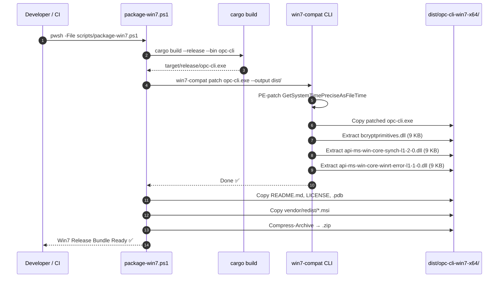

# Proposal: Extract Windows 7 Polyfills into Standalone `win7-compat` Project

| Field | Value |
|:---|:---|
| **Author** | Architect |
| **Date** | 2026-07-30 |
| **Status** | Draft — Pending Approval |
| **Scope** | Extract `compat/` polyfill crates from `opc-cli` into a reusable standalone project |

---

## 1. Problem Statement

During `opc-cli` development, three `#![no_std]` polyfill DLL crates were created under `compat/` to enable modern Rust binaries to run on Windows 7 SP1 / Server 2008 R2 SP1 (NT 6.1). These polyfills intercept Win8+-only API imports that Rust's standard library and popular crates (`getrandom`, `parking_lot`, `windows-rs`) depend on at runtime.

These polyfills have **zero coupling** to OPC DA or any domain logic in `opc-cli`. They solve a **universal Rust ecosystem problem**: any modern Rust application targeting legacy Windows 7 deployments (common in industrial control, SCADA, and manufacturing environments) faces the same runtime import failures.

Currently, the polyfills live inside the `opc-cli` repository but are explicitly excluded from its Cargo workspace (`exclude = ["compat/*"]`), creating an awkward architectural boundary. This proposal recommends extracting them into a dedicated, reusable project.

---

## 2. Current Architecture

### 2.1 Polyfill Inventory

| Crate | Output DLL | Win8+ API Polyfilled | Mechanism | Size |
|:---|:---|:---|:---|:---|
| `bcrypt-polyfill` | `bcryptprimitives.dll` | `ProcessPrng` | Routes to `advapi32!RtlGenRandom` (SystemFunction036) | 9 KB |
| `synch-polyfill` | `api-ms-win-core-synch-l1-2-0.dll` | `WaitOnAddress`, `WakeByAddressSingle`, `WakeByAddressAll` | 1ms `kernel32!Sleep` polling loop | 9 KB |
| `winrt-error-polyfill` | `api-ms-win-core-winrt-error-l1-1-0.dll` | `RoOriginateError`, `RoOriginateErrorW`, + 7 more WinRT error stubs | Returns `S_OK` / `S_FALSE` no-ops | 9 KB |

**Total embedded payload: ~27 KB**

### 2.2 PE Import Table Patcher

In addition to the DLL polyfills, `scripts/package-win7.ps1` performs a **PE binary string patch**:

- **Target**: `GetSystemTimePreciseAsFileTime` (Win8+ only)
- **Replacement**: `GetSystemTimeAsFileTime` (available since Windows 2000)
- **Method**: ASCII byte-pattern search-and-replace with NUL padding to preserve PE section alignment
- **Validation**: Post-patch binary scan confirms no stale imports remain

### 2.3 Current Build & Packaging Pipeline


All steps are orchestrated by `scripts/package-win7.ps1`. The `scripts/verify.ps1` quality pipeline includes a **Polyfill Build Gate** that compiles all `compat/*` crates on every verification run as a regression check.

### 2.4 Source Code Characteristics

- All polyfill crates are `#![no_std]` with `crate-type = ["cdylib"]` and `panic = "abort"` profiles.
- Each crate declares its own `[workspace]` (intentionally isolated).
- Dependencies: **none** — pure FFI against `advapi32.dll` and `kernel32.dll`.
- Total source: ~182 lines of Rust across 3 files.

---

## 3. Motivation for Extraction

### 3.1 Domain Independence (Confirmed)

Source inspection of all three `lib.rs` files confirms:
- Zero imports from `opc-cli` or `opc-da-client`
- Zero references to OPC, COM, DCOM, or any industrial automation concepts
- Pure C-ABI (`extern "system"`) function stubs linking only against Windows system DLLs

### 3.2 Ecosystem Reuse Value

Modern Rust applications increasingly depend on Win8+ APIs through their dependency chains:

| Rust Feature / Crate | Win8+ API Required | Polyfill Needed |
|:---|:---|:---|
| `std::sync::OnceLock`, `std::sync::LazyLock` | `WaitOnAddress` | `synch-polyfill` |
| `getrandom` crate (used by `rand`, `uuid`, etc.) | `ProcessPrng` | `bcrypt-polyfill` |
| `windows-rs` error handling | `RoOriginateError` | `winrt-error-polyfill` |
| `std::time::Instant` (precision path) | `GetSystemTimePreciseAsFileTime` | PE patch |

Any Rust developer building for legacy Windows 7 / Server 2008 R2 targets would benefit from a standalone polyfill toolkit.

### 3.3 Workspace Simplification

Extracting `compat/` removes:
- The `exclude = ["compat/*"]` entry from root `Cargo.toml`
- Three standalone `[workspace]` declarations that exist only because polyfills can't join the main workspace (incompatible `#![no_std]` cdylib profiles)
- The polyfill build gate complexity from `verify.ps1`

### 3.4 Lifecycle Decoupling

| Aspect | `opc-cli` | Polyfills |
|:---|:---|:---|
| Change frequency | High (features, UI, OPC fixes) | Very rare (only when new Win8+ imports surface) |
| Build profile | `dev` + `test` + `release` | `release` only (`#![no_std]`, `panic=abort`) |
| Testing | 71 unit tests, doctests, AST-grep | Compilation-only gate (no runtime tests possible without Win7 target) |

---

## 4. Design Decisions (from Design Interview)

The following decisions were resolved through a structured `/grill-me` design interview:

| # | Decision Area | Selected Option | Rationale |
|:---|:---|:---|:---|
| 1 | **Hosting** | Dedicated separate GitHub repository | Full decoupling; independent release lifecycle; ecosystem reusability |
| 2 | **DLL Distribution** | Embed prebuilt DLLs via `include_bytes!()` in the CLI binary | Zero runtime download dependencies; 27 KB total payload is trivial |
| 3 | **PE Patcher** | Native Rust byte-pattern string replacement | Replaces PowerShell dependency; cross-platform build capability |
| 4 | **Asset Bundling** | ~~`--extra`/`--redist` flag~~ → **Descoped** (see §5.3) | Scope creep; `package-win7.ps1` already handles project-specific packaging |

---

## 5. Critical Review Findings

A post-brainstorm architectural review identified four issues requiring resolution before implementation.

### 5.1 🟠 Bootstrapping Problem

**Issue**: Embedding prebuilt polyfill DLLs via `include_bytes!()` creates a build-time dependency: the DLLs must exist *before* the CLI binary can be compiled.

**Resolution Options**:

| Approach | Feasibility | Trade-off |
|:---|:---|:---|
| **`build.rs` nested cargo invocations** *(Recommended)* | High | `build.rs` invokes `cargo build --release` on each polyfill sub-crate, copies outputs to `OUT_DIR`, and `include_bytes!` references them. Works for `cargo install` from crates.io. |
| Committed binary blobs in git | Medium | Simple but requires manual rebuild when polyfill source changes. Binary blobs in VCS. |
| GitHub Release download in `build.rs` | Low | Network dependency at build time; breaks air-gapped builds. |
| CI pre-build step only | Medium | Works for published releases but `cargo install` from source still needs a build-time solution. |

**Recommended approach**: `build.rs` with nested `cargo build` invocations. The polyfill crates have zero dependencies and compile in <1 second each. The `build.rs` would:

```rust
// Pseudocode for build.rs
fn main() {
    let out_dir = std::env::var("OUT_DIR").unwrap();
    for polyfill in ["bcryptprimitives", "synch-l1-2-0", "winrt-error"] {
        // Invoke cargo build on each polyfill sub-crate
        Command::new("cargo")
            .args(["build", "--release", "--manifest-path", &format!("polyfills/{polyfill}/Cargo.toml")])
            .status()
            .expect("polyfill build failed");
        // Copy DLL to OUT_DIR for include_bytes!
    }
}
```

### 5.2 ⚠️ Naming: `cargo-win7` → `win7-compat`

**Issue**: The `cargo-<name>` naming convention implies Cargo ecosystem integration (reading `Cargo.toml`, understanding workspace structure). This tool does none of that — it's a post-build binary processing tool.

**Resolution**: Rename to `win7-compat` (standalone CLI installed via `cargo install win7-compat`).

```
# Instead of:
cargo win7 package --exe target/release/opc-cli.exe

# Use:
win7-compat patch target/release/opc-cli.exe --output dist/opc-cli-win7-x64/
```

### 5.3 ⚠️ Scope: Remove `--extra`/`--redist` Flag

**Issue**: Copying arbitrary user assets (vendor/redist MSIs) and creating zip archives are general packaging concerns unrelated to Win7 compatibility polyfills.

**Resolution**: `win7-compat` handles only:
1. PE import table patching (`GetSystemTimePreciseAsFileTime` → `GetSystemTimeAsFileTime`)
2. Embedded polyfill DLL extraction to the output directory

Project-specific packaging (copying `README.md`, `LICENSE`, `.pdb`, `vendor/redist/`, creating `.zip`) remains in `scripts/package-win7.ps1`.

### 5.4 🟡 Migration of `verify.ps1` Polyfill Build Gate

**Issue**: Removing `compat/` from `opc-cli` eliminates the Polyfill Build Gate in `scripts/verify.ps1` (Gate 5). This regression check must be preserved.

**Resolution**: The `win7-compat` repository gets its own CI pipeline (GitHub Actions) that compiles all polyfill crates and runs the CLI binary tests. The `verify.ps1` gate is removed from `opc-cli` since polyfill source no longer lives there.

---

## 6. Proposed Architecture

### 6.1 Repository Structure

```
wends155/win7-compat/                # New dedicated GitHub repository
├── Cargo.toml                       # Workspace root
├── README.md                        # Usage documentation & ecosystem context
├── LICENSE                          # MIT
│
├── polyfills/                       # #![no_std] cdylib polyfill source crates
│   ├── bcryptprimitives/
│   │   ├── Cargo.toml               # [lib] name="bcryptprimitives", crate-type=["cdylib"]
│   │   └── src/lib.rs               # ProcessPrng → RtlGenRandom
│   ├── synch-l1-2-0/
│   │   ├── Cargo.toml               # [lib] name="api_ms_win_core_synch_l1_2_0", crate-type=["cdylib"]
│   │   └── src/lib.rs               # WaitOnAddress → Sleep loop
│   └── winrt-error/
│       ├── Cargo.toml               # [lib] name="api_ms_win_core_winrt_error_l1_1_0", crate-type=["cdylib"]
│       └── src/lib.rs               # RoOriginateError → S_OK stub
│
├── cli/                             # The CLI binary crate ("win7-compat")
│   ├── Cargo.toml                   # [[bin]] name = "win7-compat", dependencies = [clap]
│   ├── build.rs                     # Compiles polyfills, embeds DLLs via include_bytes!
│   └── src/
│       ├── main.rs                  # CLI entry point (clap argument parsing)
│       ├── patcher.rs               # PE byte-pattern import table patcher
│       └── extractor.rs             # Embedded DLL extraction to output directory
│
└── .github/
    └── workflows/
        └── ci.yml                   # CI: compile polyfills, build CLI, run tests
```

### 6.2 CLI Interface Design

```
win7-compat 0.1.0
Make modern Rust binaries run on Windows 7 SP1 / Server 2008 R2 SP1

USAGE:
    win7-compat patch <EXE_PATH> [OPTIONS]

COMMANDS:
    patch       PE-patch a binary and extract polyfill DLLs

OPTIONS:
    --output <DIR>    Output directory for patched binary and polyfill DLLs
                      [default: same directory as input EXE]
    --dry-run         Show what would be patched without modifying files
    --verbose         Print detailed patch information
    -h, --help        Print help
    -V, --version     Print version

EXAMPLES:
    win7-compat patch target/release/myapp.exe
    win7-compat patch target/release/myapp.exe --output dist/win7-bundle/
```

### 6.3 Integration with `opc-cli`

After extraction, `scripts/package-win7.ps1` simplifies from 6 steps to 4:

```powershell
# BEFORE (current — 6 steps)
# [1/6] cargo build --release (opc-cli)
# [2/6] cargo build 3x polyfill crates
# [3/6] PE-patch GetSystemTimePreciseAsFileTime (PowerShell byte manipulation)
# [4/6] Assemble dist/ directory
# [5/6] Copy vendor/redist MSIs
# [6/6] Compress to .zip

# AFTER (proposed — 4 steps)
# [1/4] cargo build --release (opc-cli)
# [2/4] win7-compat patch target/release/opc-cli.exe --output dist/opc-cli-win7-x64/
# [3/4] Copy README, LICENSE, .pdb, vendor/redist MSIs
# [4/4] Compress to .zip
```

### 6.4 Architectural Flow



---

## 7. Impact on `opc-cli` Repository

### 7.1 Files Removed

| Path | Description |
|:---|:---|
| `compat/bcrypt-polyfill/` | Entire crate directory |
| `compat/synch-polyfill/` | Entire crate directory |
| `compat/winrt-error-polyfill/` | Entire crate directory |

### 7.2 Files Modified

| File | Change |
|:---|:---|
| `Cargo.toml` | Remove `exclude = ["compat/*"]` |
| `scripts/package-win7.ps1` | Replace Steps 2-3 (polyfill compile + PE patch) with single `win7-compat patch` invocation |
| `scripts/verify.ps1` | Remove Polyfill Build Gate (Gate 5) |
| `architecture.md` | Update Section 4 (remove `compat/` from tree), Section 10 (remove polyfill build gate), Section 12 (add `win7-compat` as external dependency) |
| `context.md` | Append TARS summary for extraction |
| `.gitignore` | Remove any `compat/target/` entries |

### 7.3 New Dependencies

| Dependency | Type | Installation |
|:---|:---|:---|
| `win7-compat` CLI | Dev/release tooling (not a Cargo dependency) | `cargo install win7-compat` or download from GitHub Releases |

---

## 8. Risk Assessment

| Risk | Likelihood | Impact | Mitigation |
|:---|:---|:---|:---|
| `build.rs` nested cargo invocations break in sandboxed environments | Low | Medium | Provide pre-compiled GitHub Release binaries as fallback |
| New Win8+ import surfaces in future Rust versions | Low | Low | Add new polyfill crate to `win7-compat`; release new version |
| `win7-compat` tool not installed on developer machine | Medium | Low | `package-win7.ps1` checks for `win7-compat` and prints install instructions |
| PE patcher byte pattern breaks with future MSVC linker changes | Very Low | High | The pattern (`GetSystemTimePreciseAsFileTime`) is a stable PE import name string; unlikely to change format |

---

## 9. Open Questions

1. **Crates.io Publishing**: Should `win7-compat` be published to crates.io for `cargo install` convenience, or distributed only via GitHub Releases?
2. **Minimum Supported Rust Version (MSRV)**: Should `win7-compat` target the same MSRV as `opc-cli` (1.88 / edition 2024), or a lower MSRV for broader compatibility?
3. **Additional PE Patches**: Are there other Win8+-only import strings that should be included in the patcher beyond `GetSystemTimePreciseAsFileTime`? Should the tool accept a user-configurable patch list?

---

## 10. Decision Required

This proposal is ready for review. Next steps based on your decision:

| Decision | Action |
|:---|:---|
| **Approve** | Proceed with `/architecture` → `/plan-making` → `/build` cycle to create `win7-compat` repository and refactor `opc-cli` |
| **Revise** | Identify specific sections needing changes; update proposal |
| **Defer** | Save conclusions to `context.md` for future reference |
| **Reject** | No action; polyfills remain in `compat/` |
